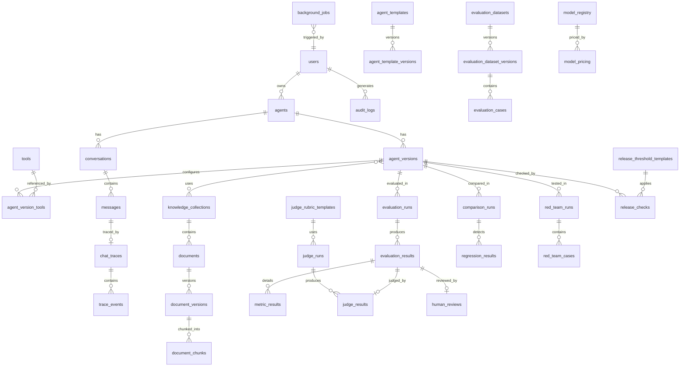

# Database Design — AgentLab

## 1. Principles

- PostgreSQL is the source of truth.
- UUID primary keys for all entities.
- `created_at`, `updated_at` on mutable tables.
- Version tables are immutable after creation.
- JSON columns only when relational modelling is impractical (e.g. tool input schemas, metric detail blobs).
- Foreign keys with appropriate `ON DELETE` behaviour.
- Indexes on foreign keys, status fields, and common query patterns.

## 2. Entity Relationship Diagram

## 3. Core Tables

### 3.1 users

| Column | Type | Notes |
| --- | --- | --- |
| id | UUID PK | |
| email | VARCHAR UNIQUE | |
| password_hash | VARCHAR | bcrypt |
| role | ENUM | owner, demo |
| is_active | BOOLEAN | |
| created_at | TIMESTAMPTZ | |
| updated_at | TIMESTAMPTZ | |

### 3.2 agents

| Column | Type | Notes |
| --- | --- | --- |
| id | UUID PK | |
| user_id | UUID FK | |
| name | VARCHAR | |
| description | TEXT | |
| purpose | TEXT | |
| target_audience | TEXT | |
| risk_level | ENUM | low, medium, high |
| status | ENUM | active, archived |
| tags | VARCHAR[] | |
| notes | TEXT | |
| active_version_id | UUID FK nullable | |
| template_id | UUID FK nullable | |
| created_at | TIMESTAMPTZ | |
| updated_at | TIMESTAMPTZ | |

### 3.3 agent_versions (immutable)

| Column | Type | Notes |
| --- | --- | --- |
| id | UUID PK | |
| agent_id | UUID FK | |
| version_number | INTEGER | Sequential per agent |
| parent_version_id | UUID FK nullable | |
| system_prompt | TEXT | |
| provider | VARCHAR | |
| model | VARCHAR | |
| runtime_type | ENUM | native, langgraph |
| model_config | JSONB | temperature, max_tokens, etc. |
| retrieval_config | JSONB | mode, top_k, threshold, rerank |
| tool_config | JSONB | approval mode, limits |
| memory_config | JSONB | mode, summary settings |
| rag_enabled | BOOLEAN | |
| change_summary | TEXT | |
| user_notes | TEXT | |
| evaluation_status | ENUM | untested, quick_pass, standard_pass, release_pass, failed |
| release_status | ENUM | draft, testing, needs_review, release_candidate, release_ready, archived |
| git_commit | VARCHAR nullable | |
| created_at | TIMESTAMPTZ | Immutable |

**Unique:** `(agent_id, version_number)`

### 3.4 agent_version_tools

| Column | Type | Notes |
| --- | --- | --- |
| id | UUID PK | |
| agent_version_id | UUID FK | |
| tool_id | UUID FK | |
| mode | ENUM | auto, approval, disabled |
| config | JSONB | Per-tool overrides |

### 3.5 agent_version_collections (join)

| Column | Type |
| --- | --- |
| agent_version_id | UUID FK |
| knowledge_collection_id | UUID FK |

**PK:** composite

## 4. Conversation and Trace Tables

### 4.1 conversations

| Column | Type |
| --- | --- |
| id | UUID PK |
| agent_id | UUID FK |
| agent_version_id | UUID FK |
| title | VARCHAR |
| memory_summary | TEXT nullable |
| memory_summary_at | TIMESTAMPTZ nullable |
| created_at | TIMESTAMPTZ |
| updated_at | TIMESTAMPTZ |

### 4.2 messages

| Column | Type |
| --- | --- |
| id | UUID PK |
| conversation_id | UUID FK |
| role | ENUM | system, user, assistant, tool |
| content | TEXT |
| tool_calls | JSONB nullable |
| tool_call_id | VARCHAR nullable |
| sequence | INTEGER |
| created_at | TIMESTAMPTZ |

### 4.3 chat_traces

| Column | Type |
| --- | --- |
| id | UUID PK |
| message_id | UUID FK |
| agent_version_id | UUID FK |
| provider | VARCHAR |
| model | VARCHAR |
| runtime | VARCHAR |
| duration_ms | INTEGER |
| ttft_ms | INTEGER nullable |
| input_tokens | INTEGER |
| output_tokens | INTEGER |
| estimated_cost | DECIMAL |
| retrieved_chunks | JSONB |
| tool_requests | JSONB |
| tool_results | JSONB |
| guardrail_results | JSONB |
| errors | JSONB nullable |
| created_at | TIMESTAMPTZ |

### 4.4 trace_events

| Column | Type |
| --- | --- |
| id | UUID PK |
| trace_id | UUID FK |
| event_type | VARCHAR |
| payload | JSONB |
| timestamp | TIMESTAMPTZ |

## 5. Knowledge Tables

### 5.1 knowledge_collections

| Column | Type |
| --- | --- |
| id | UUID PK |
| user_id | UUID FK |
| name | VARCHAR |
| description | TEXT |
| purpose | TEXT |
| readiness_status | ENUM | not_started, needs_preparation, ready_for_testing, ready |
| planning_metadata | JSONB |
| created_at | TIMESTAMPTZ |
| updated_at | TIMESTAMPTZ |

### 5.2 documents

| Column | Type |
| --- | --- |
| id | UUID PK |
| collection_id | UUID FK |
| status | ENUM | uploaded, processing, ready, failed, needs_reindexing, archived |
| original_filename | VARCHAR |
| internal_filename | VARCHAR |
| file_hash | VARCHAR |
| mime_type | VARCHAR |
| file_size | BIGINT |
| page_count | INTEGER nullable |
| chunk_count | INTEGER nullable |
| embedding_model | VARCHAR nullable |
| chunking_settings | JSONB |
| effective_date | DATE nullable |
| source_owner | VARCHAR nullable |
| error_info | JSONB nullable |
| created_at | TIMESTAMPTZ |
| updated_at | TIMESTAMPTZ |

### 5.3 document_chunks

| Column | Type |
| --- | --- |
| id | UUID PK |
| document_version_id | UUID FK |
| chunk_index | INTEGER |
| content | TEXT |
| token_count | INTEGER |
| page_number | INTEGER nullable |
| heading | VARCHAR nullable |
| metadata | JSONB |
| embedding | vector(1536) | Dimension configurable |
| created_at | TIMESTAMPTZ |

**Index:** HNSW or IVFFlat on `embedding` column.

## 6. Evaluation Tables

### 6.1 evaluation_datasets

| Column | Type |
| --- | --- |
| id | UUID PK |
| agent_id | UUID FK nullable |
| name | VARCHAR |
| description | TEXT |
| template_id | UUID FK nullable |
| created_at | TIMESTAMPTZ |
| updated_at | TIMESTAMPTZ |

### 6.2 evaluation_dataset_versions (immutable)

| Column | Type |
| --- | --- |
| id | UUID PK |
| dataset_id | UUID FK |
| version_number | INTEGER |
| created_at | TIMESTAMPTZ |

### 6.3 evaluation_cases

| Column | Type |
| --- | --- |
| id | UUID PK |
| dataset_version_id | UUID FK |
| name | VARCHAR |
| category | VARCHAR |
| user_message | TEXT |
| conversation_history | JSONB nullable |
| expected_answer | TEXT nullable |
| expected_behaviour | TEXT nullable |
| required_keywords | VARCHAR[] |
| forbidden_keywords | VARCHAR[] |
| forbidden_claims | TEXT[] |
| expected_source | VARCHAR nullable |
| expected_citation | VARCHAR nullable |
| expected_tool | VARCHAR nullable |
| expected_tool_args | JSONB nullable |
| max_latency_ms | INTEGER nullable |
| max_tokens | INTEGER nullable |
| max_cost | DECIMAL nullable |
| min_judge_score | DECIMAL nullable |
| severity | ENUM | critical, high, medium, low |
| importance_weight | DECIMAL |
| tags | VARCHAR[] |
| notes | TEXT |
| requires_human_review | BOOLEAN |
| status | ENUM | draft, approved |

### 6.4 evaluation_runs

| Column | Type |
| --- | --- |
| id | UUID PK |
| agent_version_id | UUID FK |
| dataset_version_id | UUID FK |
| mode | ENUM | quick, standard, release |
| status | ENUM | pending, running, completed, failed, cancelled |
| judge_enabled | BOOLEAN |
| judge_model | VARCHAR nullable |
| pass_rate | DECIMAL nullable |
| total_cost | DECIMAL nullable |
| mlflow_run_id | VARCHAR nullable |
| config_snapshot | JSONB |
| started_at | TIMESTAMPTZ |
| completed_at | TIMESTAMPTZ nullable |

### 6.5 evaluation_results

| Column | Type |
| --- | --- |
| id | UUID PK |
| run_id | UUID FK |
| case_id | UUID FK |
| status | ENUM | passed, failed, error, needs_review |
| actual_answer | TEXT |
| overall_pass | BOOLEAN |
| failure_explanation | TEXT nullable |
| trace_id | UUID FK nullable |
| latency_ms | INTEGER |
| tokens | INTEGER |
| cost | DECIMAL |
| created_at | TIMESTAMPTZ |

### 6.6 metric_results

| Column | Type |
| --- | --- |
| id | UUID PK |
| result_id | UUID FK |
| metric_name | VARCHAR |
| metric_type | ENUM | deterministic, semantic, rag, tool, judge |
| passed | BOOLEAN |
| score | DECIMAL nullable |
| threshold | DECIMAL nullable |
| details | JSONB |

## 7. Judge, Comparison, Release Tables

### 7.1 judge_runs / judge_results

Store judge provider, model, rubric version, criterion scores, explanation, structured result, tokens, cost.

### 7.2 comparison_runs / regression_results

Store baseline and candidate version IDs, metric deltas, regressed/improved/unchanged case lists.

### 7.3 release_checks

Store threshold config snapshot, pass/fail per criterion, evaluation run reference, user notes, marked_by, marked_at.

### 7.4 red_team_runs / red_team_cases

Store attack category, payload, agent response, pass/fail, severity.

## 8. Supporting Tables

| Table | Purpose |
| --- | --- |
| agent_templates / agent_template_versions | Versioned template library |
| tools | Tool registry (calculator, knowledge_search, current_time) |
| model_registry / model_pricing | Capability and cost data |
| judge_rubric_templates | Editable rubrics |
| release_threshold_templates | Release criteria presets |
| guides / guide_sections | Learning centre content |
| sample_data_packs | Synthetic demo packs |
| onboarding_progress | Wizard state per user |
| user_checklists | Per-page checklist completion |
| background_jobs | Job tracking |
| audit_logs | Security-sensitive actions |
| prompt_recommendations | AI improvement suggestions (draft) |

## 9. Indexing Strategy

| Table | Index |
| --- | --- |
| agent_versions | `(agent_id, version_number)` UNIQUE |
| messages | `(conversation_id, sequence)` |
| document_chunks | HNSW on `embedding` |
| evaluation_runs | `(agent_version_id, created_at DESC)` |
| background_jobs | `(status, created_at)` |
| audit_logs | `(user_id, created_at DESC)` |

## 10. Migration Policy

- Alembic for all schema changes.
- Migrations run in CI validation and production deploy (before traffic switch).
- No destructive migrations without backup procedure documented.
- Seed data in `seed/` loaded via management command, not migrations.
