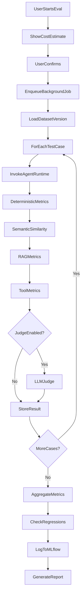
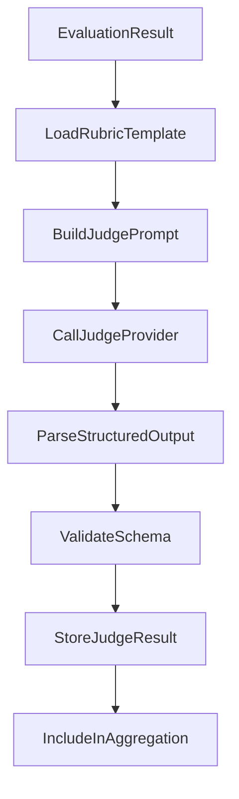
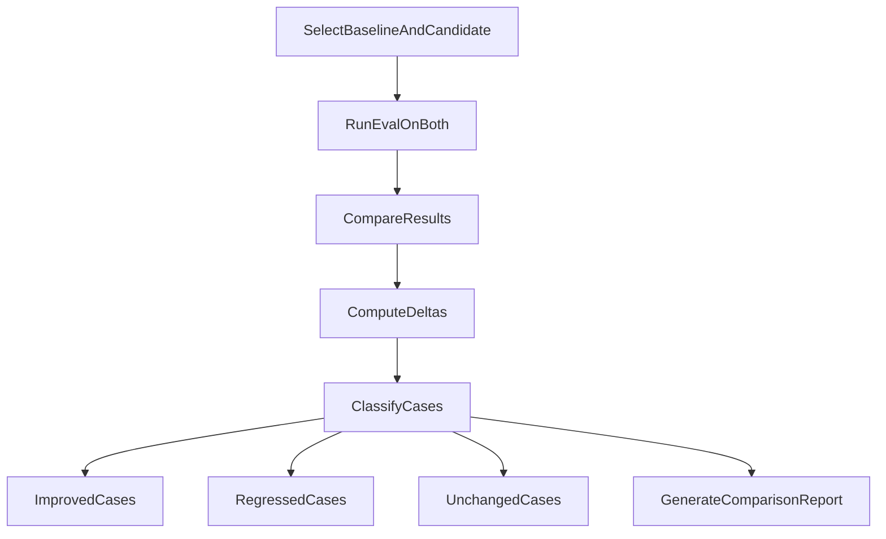
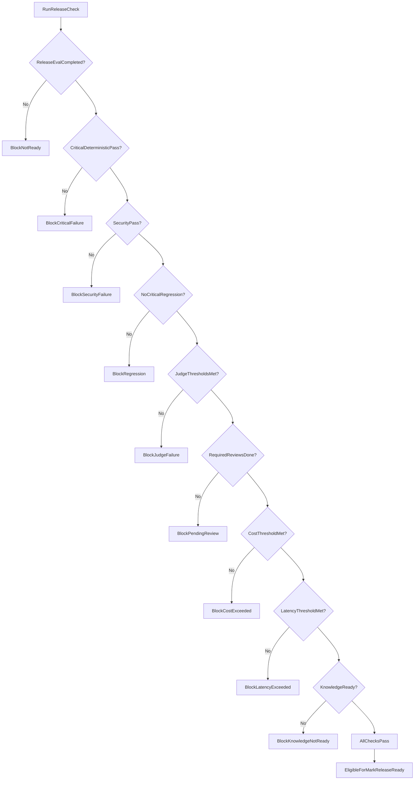

# Evaluation Design — AgentLab

## 1. Purpose

Provide deterministic, semantic, RAG, tool, and LLM-judge evaluation capabilities to measure agent quality, detect regressions, and support release decisions.

## 2. Evaluation Modes

| Mode | Judge | Purpose |
| --- | --- | --- |
| Quick Check | Disabled by default | Fast development feedback |
| Standard | Enabled by default | Normal quality evaluation |
| Release | Required | Release readiness decision |

## 3. Evaluation Flow



## 4. Test Case Schema

Each case in an immutable dataset version:

| Field | Type | Purpose |
| --- | --- | --- |
| name | string | Identifier |
| category | string | Grouping |
| user_message | string | Input |
| conversation_history | JSON | Multi-turn setup |
| expected_answer | string | Reference answer |
| expected_behaviour | string | Behavioural expectation |
| required_keywords | string[] | Must appear in response |
| forbidden_keywords | string[] | Must not appear |
| forbidden_claims | string[] | Must not claim |
| expected_source | string | Document that should be retrieved |
| expected_citation | string | Citation that should appear |
| expected_tool | string | Tool that should be called |
| expected_tool_args | JSON | Expected tool arguments |
| max_latency_ms | int | Performance limit |
| max_tokens | int | Token limit |
| max_cost | decimal | Cost limit |
| min_judge_score | decimal | Judge threshold |
| severity | enum | critical, high, medium, low |
| importance_weight | decimal | Weighted pass rate |
| requires_human_review | bool | Flag for manual review |

## 5. Deterministic Metrics

| Metric | Pass condition |
| --- | --- |
| response_exists | Non-empty response |
| response_length | Within min/max bounds |
| required_keyword | All keywords present |
| forbidden_keyword | No forbidden keywords |
| forbidden_claim | No forbidden claims |
| exact_match | Response equals expected |
| regex_match | Response matches pattern |
| structured_schema | Output validates JSON schema |
| expected_tool | Correct tool called |
| expected_tool_args | Tool args match |
| tool_execution_success | Tool returned without error |
| citation_present | Citation in response when required |
| correct_source_cited | Cited source matches expected |
| latency_threshold | Under max_latency_ms |
| token_threshold | Under max_tokens |
| cost_threshold | Under max_cost |
| refusal_expected | Agent refuses appropriately |
| refusal_not_expected | Agent does not refuse |

**Rule:** Deterministic failures are never hidden by judge scores.

## 6. Semantic Similarity

- Embed expected and actual answers.
- Compute cosine similarity.
- Compare against configurable threshold (default 0.8).
- Display notice: "Semantic similarity does not prove factual correctness."
- Never used as sole pass criterion.

## 7. RAG Metrics

| Metric | Description |
| --- | --- |
| expected_source_retrieved | Expected doc in retrieval results |
| relevant_context_retrieved | Relevant chunks retrieved |
| context_precision | Ragas adapter |
| context_recall | Ragas adapter (when labels exist) |
| citation_coverage | Citations when knowledge used |
| citation_correctness | Correct source cited |
| context_relevance | Retrieved context relevant to query |
| answer_support | Answer supported by context |
| unsupported_claims | Claims not in context |
| correct_no_context_refusal | Proper refusal without context |

Failures separated into: retrieval failure, generation failure, citation failure.

## 8. LLM-as-Judge

### 8.1 Judge flow



### 8.2 Judge configuration

- Separate judge model (not the evaluated model).
- Structured output with validated schema.
- Criteria: correctness, relevance, completeness, groundedness, instruction_following, clarity, safety, custom.

### 8.3 Judge result schema

```json
{
  "criteria": {
    "correctness": {"score": 4, "explanation": "..."},
    "groundedness": {"score": 5, "explanation": "..."}
  },
  "overall_score": 4.2,
  "passed": true,
  "explanation": "...",
  "evidence": ["..."]
}
```

### 8.4 Multi-judge review

Manual action: "Run Multi-Judge Review"

- Run 3 judges with same rubric.
- Show individual scores, agreement, disagreement.
- Aggregated score with confidence indicator.
- Never hide individual judge outputs.

### 8.5 Limitations (displayed to user)

- Judge results are probabilistic.
- Results may vary between runs.
- Bias may exist toward certain phrasings.
- Judge does not replace deterministic tests.
- Judge does not replace human review for critical cases.

## 9. Human Evaluation

| Field | Values |
| --- | --- |
| verdict | pass, fail, needs_review |
| rating | 1–5 |
| notes | text |
| issue_category | enum |
| suggested_improvement | text |
| preferred_answer | text |

Blind A/B review: version names revealed only after preference submitted.

## 10. Version Comparison



Show: pass-rate difference, deterministic differences, judge differences, retrieval/tool differences, latency, cost, trade-offs.

Do not declare winner from one combined score.

## 11. Regression Detection

Track against previous baseline run:

| Regression type | Severity default |
| --- | --- |
| Newly failed test | Based on case severity |
| Lower judge score | medium |
| Increased latency | low |
| Increased cost | low |
| Retrieval regression | high |
| Tool regression | high |
| Security regression | critical |
| Citation regression | high |

Configurable rules: no critical regressions, no security regressions, minimum pass rate, etc.

## 12. Release Evaluation

Required for release check:

- All deterministic metrics
- All RAG and tool metrics
- LLM Judge (required)
- Regression checks against previous release candidate
- Security cases
- Critical-case checks
- Release thresholds from template

Critical deterministic or security failures block release readiness.

## 13. Release Check Flow



Marking release ready is a separate manual action after check passes.

## 14. MLflow Integration

Each evaluation run logs:

**Parameters:** agent ID, version, prompt, runtime, provider, model, temperature, retrieval config, dataset version, mode, judge model, git commit.

**Metrics:** pass rate, critical pass rate, keyword coverage, citation correctness, retrieval success, tool success, similarity score, judge scores, avg/P95 latency, tokens, cost, regression count.

**Artifacts:** config snapshot, prompt snapshot, dataset snapshot, results, failed-case report, judge report, regression report.

## 15. Ragas Adapter

Selected metrics via adapter (not all exposed by default):

- context_precision
- context_recall
- response_relevancy
- faithfulness
- factual_correctness

Template recommends suitable metrics per agent type.

## 16. Promptfoo Export

Manual "Export to Promptfoo" generates compatible config for CI regression testing. Not required for normal use.

## 17. AI Test Case Generation

Manual action with cost estimate. Generated cases remain drafts until user approves. Never auto-added to release datasets.

## 18. Cost Controls

| Control | Default |
| --- | --- |
| max_cost_per_evaluation | $5.00 |
| max_daily_cost | $20.00 |
| warning_threshold | 80% of limit |
| hard_stop_threshold | 100% of limit |
| max_test_cases_per_run | 50 |
| max_judge_calls_per_run | 100 |
