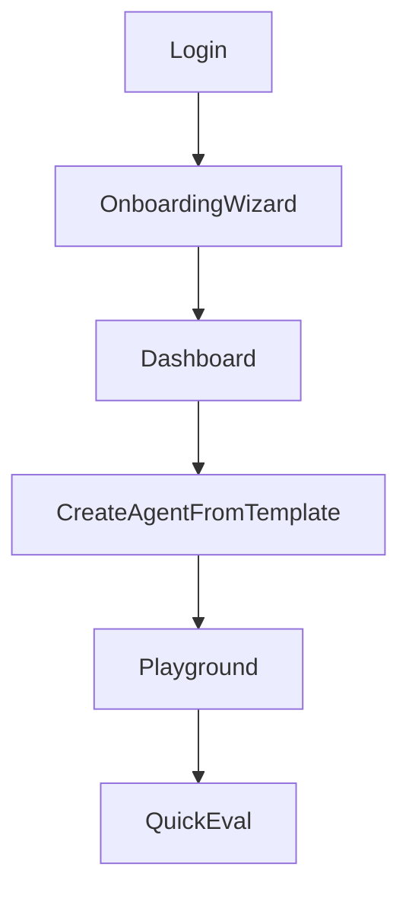
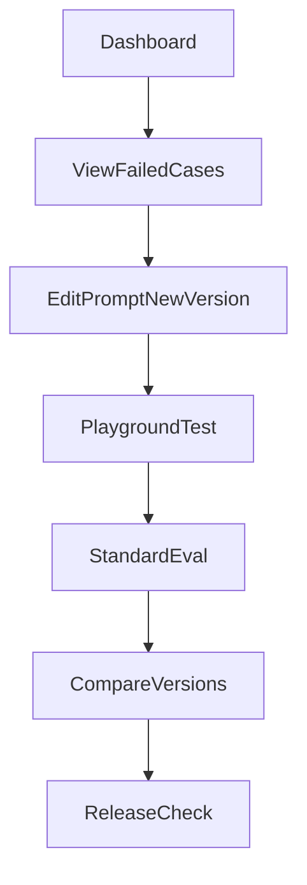
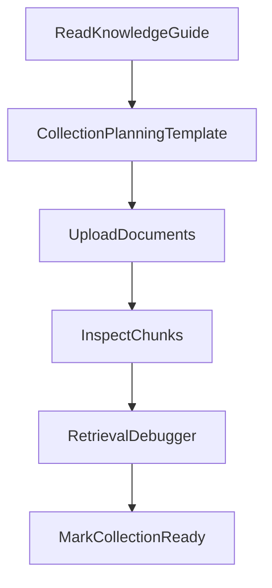
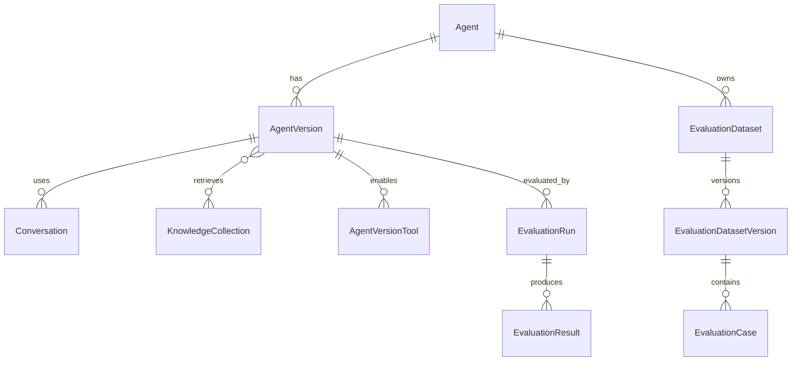

# Information Architecture — AgentLab

## 1. Site Map

```text
/login
/onboarding
/dashboard

/agents
/agents/new
/agents/:id
/agents/:id/versions
/agents/:id/versions/:versionId
/agents/:id/prompt

/playground/:agentVersionId

/knowledge
/knowledge/collections/:id
/knowledge/documents/:id
/knowledge/guides
/retrieval-debugger

/evaluations
/evaluations/datasets
/evaluations/datasets/:id
/evaluations/runs/:id

/comparisons
/red-team
/traces/:id
/jobs

/templates
/templates/:id
/sample-packs
/learning

/settings
/settings/providers
/settings/models
/settings/pricing
/settings/security
```

## 2. Navigation Groups

| Group | Routes | Purpose |
| --- | --- | --- |
| **Build** | Agents, Templates, Sample Packs | Create and configure agents |
| **Test** | Playground, Retrieval Debugger, Traces | Interactive testing |
| **Knowledge** | Collections, Documents, Guides | RAG preparation |
| **Evaluate** | Datasets, Runs, Comparisons, Red Team | Quality and safety |
| **Operate** | Jobs, Dashboard, Settings | Operations and config |
| **Learn** | Learning Centre, Guides | Education |

## 3. User Flows

### 3.1 First-time user



### 3.2 Returning user — improve agent



### 3.3 Knowledge preparation



## 4. Entity Relationships (Navigation)



## 5. Page Responsibilities

| Page | Primary data | Primary actions |
| --- | --- | --- |
| Dashboard | Aggregated metrics | Quick actions |
| Agent detail | Agent + active version | Edit, clone, archive |
| Version detail | Immutable config snapshot | Compare, activate, release check |
| Playground | Conversation + trace | Chat, override, judge (manual) |
| Collection detail | Documents + readiness | Upload, test retrieval |
| Dataset detail | Cases + versions | Import, generate (manual), export |
| Eval run detail | Results + metrics | Review failures, human rating |
| Jobs | Background job list | Cancel, retry, view error |

## 6. Content Hierarchy

### Learning Centre

Organised by topic, not by screen:

1. Foundations (agent, prompt, RAG, embeddings)
2. Building (templates, knowledge, tools)
3. Testing (playground, traces, debugger)
4. Evaluating (datasets, deterministic, judge, regression)
5. Releasing (thresholds, release check)

Each article links to the relevant application screen.

### Template Library

Templates are browsable independently of agents. Applying a template creates a new agent (or new version) without mutating the template.

## 7. URL and State Conventions

- UUIDs in URLs for all entity IDs.
- `?tab=` query param for multi-tab pages (e.g. agent detail: overview | versions | evals).
- Playground always bound to `agentVersionId` (explicit version, not "latest").
- Breadcrumbs: Dashboard > Agents > {name} > v{number} > Playground.

## 8. Search and Filtering

| Area | Filters |
| --- | --- |
| Agents | Status, tag, risk level |
| Documents | Collection, status |
| Eval runs | Mode, pass/fail, agent version |
| Jobs | Type, status, date range |
| Traces | Agent, date, has tool calls |

Global search (Phase 2+): agents and datasets by name.

## 9. Permissions (Single Owner)

| Role | Access |
| --- | --- |
| Owner | Full read/write |
| Demo (read-only) | View all; no create/edit/delete; no expensive operations |

Demo account cannot trigger evaluations, judges, red-team, or re-indexing.
