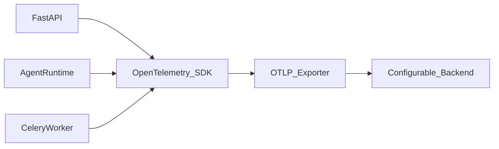

# Observability Design — AgentLab

## 1. Purpose

Provide structured logging, distributed tracing, and metrics so agent behaviour, costs, and failures are visible without depending on a single commercial observability vendor.

## 2. Logging

### 2.1 Format

Structured JSON logs via Python `structlog`:

```json
{
  "timestamp": "2026-07-16T10:00:00Z",
  "level": "info",
  "message": "chat.turn.completed",
  "request_id": "uuid",
  "user_id": "uuid",
  "agent_id": "uuid",
  "agent_version_id": "uuid",
  "conversation_id": "uuid",
  "trace_id": "uuid",
  "provider": "openai",
  "model": "gpt-4o",
  "runtime": "native",
  "duration_ms": 1234,
  "input_tokens": 500,
  "output_tokens": 200,
  "estimated_cost": 0.003,
  "error_category": null
}
```

### 2.2 Correlation IDs

| ID | Scope |
| --- | --- |
| request_id | Per HTTP request |
| trace_id | Per agent turn / eval case |
| evaluation_run_id | Per evaluation run |
| job_id | Per background job |

Passed via headers (`X-Request-ID`) and propagated through runtime, workers, and provider calls.

### 2.3 What to log

- HTTP requests (method, path, status, duration)
- Agent turns (provider, model, tokens, cost)
- Tool executions (name, duration, status)
- Retrieval operations (query hash, chunk count, duration)
- Evaluation progress (case index, pass/fail)
- Judge runs (model, criteria, score)
- Background job state changes
- Authentication events
- Errors with category

### 2.4 What NOT to log

- Passwords
- API keys or tokens
- Environment variables
- Full document contents (log chunk IDs only)
- Full model responses (log length and hash only in production)

## 3. Metrics (Prometheus)

Exposed at `/metrics` (internal network only).

### 3.1 HTTP metrics

| Metric | Type | Labels |
| --- | --- | --- |
| http_requests_total | counter | method, path, status |
| http_request_duration_seconds | histogram | method, path |

### 3.2 Model metrics

| Metric | Type | Labels |
| --- | --- | --- |
| model_requests_total | counter | provider, model, status |
| model_request_duration_seconds | histogram | provider, model |
| model_tokens_total | counter | provider, model, direction |
| model_cost_dollars_total | counter | provider, model |

### 3.3 Application metrics

| Metric | Type | Labels |
| --- | --- | --- |
| evaluation_runs_total | counter | mode, status |
| evaluation_duration_seconds | histogram | mode |
| judge_duration_seconds | histogram | model |
| retrieval_duration_seconds | histogram | mode |
| document_processing_failures_total | counter | reason |
| tool_executions_total | counter | tool, status |
| celery_queue_size | gauge | queue |
| celery_task_duration_seconds | histogram | task_name |

### 3.4 Grafana dashboards (optional)

Documented in `infrastructure/monitoring/`:

1. **Overview** — request rate, error rate, latency
2. **Agent Performance** — model latency, tokens, cost
3. **Evaluation** — run duration, pass rates
4. **Infrastructure** — queue depth, worker health, DB connections

## 4. Tracing (OpenTelemetry)

### 4.1 Architecture



### 4.2 Spans

| Span name | Parent | Attributes |
| --- | --- | --- |
| http.request | root | method, path, status |
| agent.turn | http.request | agent_version_id, model |
| retrieval.search | agent.turn | query_hash, top_k, mode |
| provider.chat | agent.turn | provider, model, tokens |
| tool.execute | agent.turn | tool_name, duration |
| evaluation.case | evaluation.run | case_id, status |
| judge.evaluate | evaluation.case | model, criteria |
| document.process | celery.task | document_id, status |

### 4.3 Exporters (configurable)

| Exporter | Use case |
| --- | --- |
| Console | Development |
| OTLP | Generic OpenTelemetry backend |
| MLflow | Evaluation trace correlation |

Langfuse and Arize Phoenix: configure OTLP only — see [otel-backends.md](../integrations/otel-backends.md). Core code does not depend on any single vendor.

## 5. Application Traces (Product Feature)

Separate from OpenTelemetry: `chat_traces` and `trace_events` tables store user-visible traces in the playground trace panel. These are the product feature; OTel is operational.

## 6. Health Checks

| Endpoint | Checks |
| --- | --- |
| `/health` | Process alive |
| `/ready` | PostgreSQL connection, Redis connection |

Docker health checks on all containers. Traefik routes only to healthy backends.

## 7. Alerting (Portfolio)

Documented recommendations (not automated in MVP):

| Condition | Action |
| --- | --- |
| Error rate > 5% for 5 min | Check logs |
| Daily cost > warning threshold | Review eval runs |
| Queue depth > 50 for 10 min | Scale worker or investigate |
| DB connection failures | Check PostgreSQL health |

## 8. Log Rotation

Docker logging driver with `max-size: 10m`, `max-file: 5` per container.

## 9. MLflow as Observability

Evaluation runs logged to MLflow with parameters, metrics, and artifacts. Provides experiment comparison independent of real-time metrics.

## 10. Cost Observability

Tracked at multiple levels:

| Level | Storage |
| --- | --- |
| Per message | chat_traces.estimated_cost |
| Per evaluation | evaluation_runs.total_cost |
| Per judge | judge_results.cost |
| Per day | Aggregated in dashboard |
| Per embedding job | background_jobs metadata |

All costs marked `estimated` when exact token counts unavailable.
