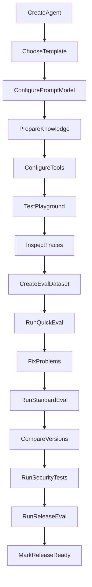

# Product Requirements — AgentLab

## 1. Vision

AgentLab is a production-quality portfolio application that demonstrates Applied AI and Machine Learning Engineering. It is not a basic chatbot wrapper. Its primary value is the end-to-end workflow from agent creation through evaluation, comparison, security testing, and release readiness.

## 2. Target User

- **Primary:** Solo developer or product builder (portfolio owner) building and validating AI agents.
- **Secondary:** Technical reviewers and interviewers evaluating ML engineering skills.

## 3. Primary Questions AgentLab Must Answer

| Question | Capability |
| --- | --- |
| Is my agent accurate? | Deterministic + semantic + judge metrics |
| Does it follow instructions? | Instruction-following judge + deterministic checks |
| Does it use correct knowledge? | RAG metrics, retrieval debugger, citations |
| Does it cite correct sources? | Citation correctness metrics |
| Does it know when info is unavailable? | Refusal / no-context cases |
| Does it call the correct tool? | Tool-call accuracy metrics |
| Is it vulnerable to prompt injection? | Red-team suite |
| Is the new prompt better? | Version comparison |
| Which model is more suitable? | Model comparison |
| How much does each response cost? | Cost tracking per message/eval |
| How fast is the agent? | Latency metrics (avg, P95) |
| Did a change introduce regressions? | Regression detection |
| Is the agent safe enough to release? | Release evaluation + release check |

## 4. Core Workflow

## 5. Product Principles

### 5.1 Template-first

Every major section provides templates, recommended defaults, examples, checklists, common mistakes, previews, and links to guides.

### 5.2 Progressive disclosure

Basic settings visible first; advanced settings in expandable sections.

### 5.3 Manual expensive operations

LLM Judge, multi-judge, AI test generation, prompt improvement, red-team, re-index, full evaluation, and release check require explicit user action with cost estimates shown beforehand.

### 5.4 Explain results

Every failure explains what failed, expected vs actual behaviour, likely cause, relevant context/tools, judge feedback, and suggested next action.

### 5.5 Safe defaults

Limited batch sizes, agent steps, retries, tool calls; manual approval for sensitive tools; no arbitrary web/SQL/code execution; no public registration; no automatic release approval.

## 6. Functional Requirements (MVP)

### 6.1 Authentication

- One owner account with secure login/logout.
- Optional read-only demo account.
- No public registration, teams, billing, or SSO.

### 6.2 Agent management

- CRUD agents with immutable version history.
- Clone, archive, restore, export/import (no secrets).
- Version comparison and release status tracking.

### 6.3 Templates

Nine initial templates (Customer Support, ERP Support, HR Policy, Document Q&A, Sales Product, Developer Docs, Compliance, General, Empty).

### 6.4 Playground

- Three-panel layout: config, conversation (SSE streaming), trace inspection.
- Temporary overrides with save-as-version option.

### 6.5 Knowledge and RAG

- Collections, document upload (MD, TXT, text PDF, FAQ CSV), chunking, embeddings, hybrid retrieval, citations, retrieval debugger.

### 6.6 Tools

- Calculator, Knowledge Search, Current Date/Time.
- Automatic, approval-required, or disabled modes.

### 6.7 Evaluation

- Dataset versioning, Quick/Standard/Release modes.
- Deterministic, semantic, RAG, tool metrics.
- LLM-as-Judge (optional/required by mode).
- Human review and blind A/B comparison.

### 6.8 Comparison and regression

- Version, model, prompt, retrieval, tool comparisons.
- Regression detection with configurable thresholds.

### 6.9 Security

- Red-team testing (manual).
- Prompt injection resistance in runtime and RAG.

### 6.10 Observability and cost

- Traces, structured logs, Prometheus metrics.
- Cost estimates per message, evaluation, and judge run.

### 6.11 Integrations

- MLflow for experiment tracking.
- Ragas adapter for selected metrics.
- Promptfoo-compatible export.
- OpenTelemetry-compatible tracing.

## 7. Non-Functional Requirements

| Area | Requirement |
| --- | --- |
| Security | OWASP-aligned controls; secrets server-side only |
| Reliability | Retries, idempotency, graceful cancellation |
| Performance | Streaming chat; background jobs for heavy work |
| Testability | Mock provider for CI; opt-in live tests |
| Deployability | Docker Compose on Hostinger VPS with HTTPS |
| Maintainability | Modular monolith; typed interfaces |

## 8. Out of Scope (Initial Release)

- Multi-agent teams, CrewAI, visual workflow builder
- Public registration, billing, marketplace
- Fine-tuning, voice, image generation
- Arbitrary web browsing, SQL, HTTP connectors, code execution tools
- Kubernetes, multi-region, native mobile
- Enterprise organisation management

## 9. Definition of Done

See [implementation-plan.md](implementation-plan.md) for phased delivery. The product is complete when all items in the master prompt Definition of Done (section 66) are verified with automated tests and documented manual procedures.

## 10. Success Criteria (Portfolio)

- Demonstrates RAG, tool calling, evaluation, LLM judge, regression detection, and production deployment.
- Synthetic ERP Support sample pack runs end-to-end.
- Architecture and trade-offs are explainable in a technical interview.
- No invented production metrics in documentation.
