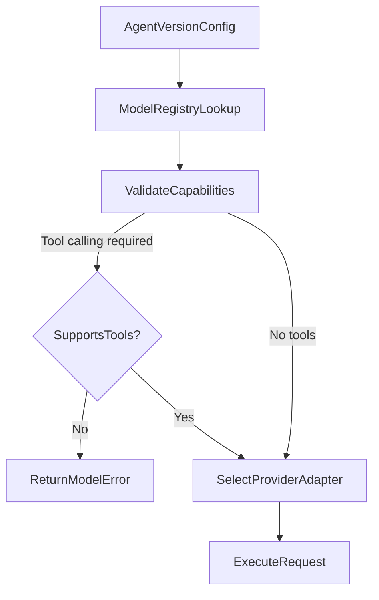

# Provider Design — AgentLab

## 1. Purpose

Abstract all LLM provider interactions behind typed interfaces so AgentLab supports any OpenAI-compatible API without hard-coding a single vendor.

## 2. Provider Types

| Type | Purpose | Env prefix |
| --- | --- | --- |
| Chat | Agent conversation | `AI_*` |
| Embedding | Document and query vectors | `EMBEDDING_*` |
| Judge | LLM-as-Judge evaluations | `JUDGE_*` |

## 3. Environment Variables

```text
AI_BASE_URL=
AI_API_KEY=
AI_DEFAULT_MODEL=

EMBEDDING_BASE_URL=
EMBEDDING_API_KEY=
EMBEDDING_MODEL=

JUDGE_BASE_URL=
JUDGE_API_KEY=
JUDGE_MODEL=
```

Judge uses a separate model from the evaluated agent by default.

## 4. Interface Contracts

### 4.1 ChatProvider

```python
class ChatProvider(Protocol):
    async def complete(
        self, request: ChatRequest
    ) -> ChatResponse: ...

    async def stream(
        self, request: ChatRequest
    ) -> AsyncIterator[StreamEvent]: ...
```

### 4.2 EmbeddingProvider

```python
class EmbeddingProvider(Protocol):
    async def embed(
        self, texts: list[str]
    ) -> list[list[float]]: ...
```

### 4.3 JudgeProvider

Extends ChatProvider with structured output enforcement for rubric scoring.

## 5. Request/Response Models

### ChatRequest

| Field | Type |
| --- | --- |
| model | str |
| messages | list[Message] |
| temperature | float |
| max_tokens | int |
| tools | list[ToolDefinition] optional |
| response_format | StructuredFormat optional |
| stop | list[str] optional |

### ChatResponse

| Field | Type |
| --- | --- |
| content | str |
| tool_calls | list[ToolCall] |
| usage | TokenUsage |
| finish_reason | str |
| latency_ms | int |

### TokenUsage

| Field | Type |
| --- | --- |
| input_tokens | int |
| output_tokens | int |
| total_tokens | int |

## 6. Adapter Implementation

**Primary adapter:** `OpenAICompatibleProvider` using HTTPX.

- Supports `/v1/chat/completions` (streaming and non-streaming)
- Supports `/v1/embeddings`
- Configurable base URL and API key per provider type

**Mock adapter:** `MockProvider` for CI and local dev.

- Deterministic responses based on input hash
- Configurable tool call scenarios
- Simulated streaming with chunked tokens
- Error injection (timeout, rate limit, invalid JSON)

## 7. Error Handling

| Error | Handling |
| --- | --- |
| Invalid credentials | 401 to user; log provider error category |
| Rate limit (429) | Exponential backoff (max 3 retries) |
| Timeout | Fail with clear message; count as operational error |
| Provider outage (5xx) | Retry once; then fail gracefully |
| Context overflow | Truncate with warning or fail with token count |
| Unsupported tool calling | Return error before call; suggest model change |
| Unsupported structured output | Fall back to JSON mode or fail |
| Invalid structured output | Retry once with stricter prompt |
| Missing token info | Estimate from tokenizer; mark as estimated |
| Content filtering | Return filtered notice to user |
| User cancellation | Abort stream; persist partial response |

## 8. Model Capability Registry

Stored in `model_registry` table:

| Field | Purpose |
| --- | --- |
| provider | Provider name |
| model | Model ID |
| context_limit | Max input tokens |
| streaming | bool |
| tool_calling | bool |
| structured_output | bool |
| embedding | bool |
| vision | bool |
| input_token_cost | Decimal |
| output_token_cost | Decimal |
| active | bool |
| last_verified | Date |
| notes | Text |

### Presets

| Preset | Characteristics |
| --- | --- |
| Balanced | Default temperature, general model |
| Accurate and Consistent | Low temperature, structured output |
| Creative | Higher temperature (creative tasks only) |
| Cost Focused | Cheaper model, shorter max tokens |
| High Quality Review | Stronger model with cost warning |

## 9. Cost Calculation

```text
cost = (input_tokens * input_price) + (output_tokens * output_price)
```

- Prices from `model_pricing` table with effective dates.
- Mark as `estimated` when token counts are unavailable.
- Accumulate per trace, per eval run, per judge run.

## 10. Provider Selection Flow



## 11. Security

- API keys stored in environment variables only (server-side).
- Keys never returned in API responses or logs.
- Provider responses treated as untrusted content.
- No provider key exposure to frontend or client-side code.

## 12. Testing Strategy

- Unit tests with MockProvider for all code paths.
- Integration tests with recorded HTTP fixtures (VCR/responses).
- Opt-in live tests: `LIVE_PROVIDER_TESTS=1 pytest tests/live/`
