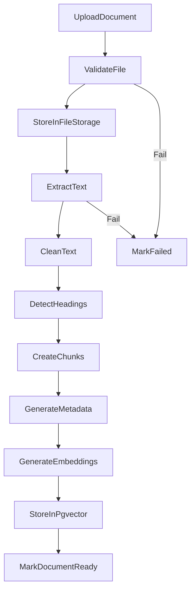
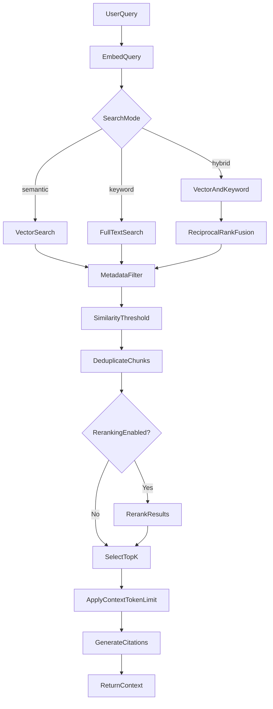
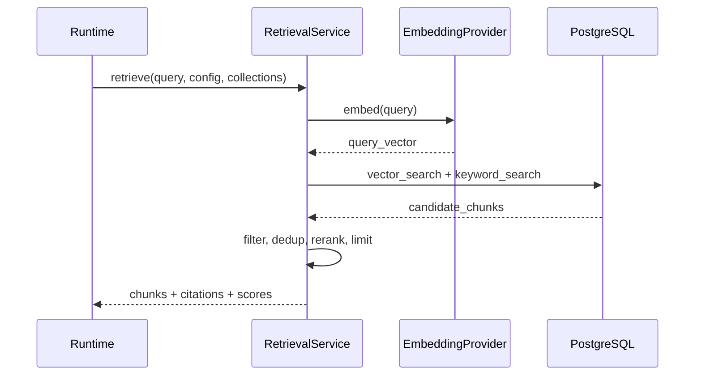

# RAG Design — AgentLab

## 1. Purpose

Enable agents to answer questions from approved knowledge collections with accurate retrieval, citation, and safety against indirect prompt injection.

## 2. Ingestion Pipeline



### Ingestion steps

1. Upload validation (size, extension, MIME, empty, duplicate, unsafe filename)
2. Safe storage (never execute uploaded files)
3. Text extraction (MD, TXT, text-based PDF, manual entry, FAQ CSV)
4. Text cleaning (whitespace, encoding, header/footer removal)
5. Heading detection (structure-aware chunking)
6. Chunking (configurable size and overlap)
7. Metadata generation (page, heading, source, effective date)
8. Embedding generation (via EmbeddingProvider)
9. Vector storage (pgvector)
10. Status update

OCR is out of scope for MVP.

## 3. Document Validation Rules

| Check | Action on fail |
| --- | --- |
| File size > limit (e.g. 20MB) | Reject upload |
| Unsupported extension | Reject upload |
| MIME mismatch | Reject upload |
| Empty file | Reject upload |
| Duplicate hash in collection | Warn + skip or replace |
| Unsafe filename (path traversal) | Sanitize or reject |
| Encrypted PDF | Mark failed |
| Unsupported PDF (image-only) | Mark failed |
| Page count > limit | Reject or truncate |

## 4. Chunking Strategy

| Setting | Default | Range |
| --- | --- | --- |
| chunk_size_tokens | 512 | 128–1024 |
| chunk_overlap_tokens | 64 | 0–256 |
| respect_headings | true | — |

FAQ CSV: one chunk per Q&A pair.

## 5. Retrieval



### Retrieval settings

| Setting | Default |
| --- | --- |
| top_k | 5 |
| similarity_threshold | 0.7 |
| search_mode | hybrid |
| reranking_enabled | false |
| context_token_limit | 2000 |
| collection_filter | agent's linked collections |

### Retrieval presets

| Preset | top_k | threshold | mode |
| --- | --- | --- | --- |
| Basic Semantic | 5 | 0.7 | semantic |
| Strict Policy | 3 | 0.85 | hybrid |
| Broad Research | 10 | 0.6 | hybrid |
| FAQ Retrieval | 3 | 0.8 | keyword |
| Technical Docs | 7 | 0.75 | hybrid |

## 6. Retrieval Flow (detailed)



## 7. Citation Generation

Each retrieved chunk produces a citation:

```json
{
  "document_id": "uuid",
  "document_name": "procurement-manual.pdf",
  "chunk_id": "uuid",
  "page_number": 12,
  "heading": "Three-Way Matching",
  "excerpt": "..."
}
```

Agent system prompt requires citing supporting documents when knowledge is used.

## 8. RAG Safety

| Threat | Mitigation |
| --- | --- |
| Indirect prompt injection in documents | Separate system vs retrieved content; delimiter blocks |
| Instructions in documents overriding system | Explicit system prompt rule + red-team cases |
| Stale or conflicting documents | Effective dates, collection readiness checks |
| No relevant context | Agent must state insufficient information |

## 9. Knowledge Readiness

Before marking collection Ready:

- [ ] Authoritative source identified
- [ ] Source owner identified
- [ ] Effective date available
- [ ] Content readable
- [ ] Duplicates reviewed
- [ ] Sensitive information reviewed
- [ ] Version recorded
- [ ] Purpose defined
- [ ] Expected questions documented
- [ ] Retrieval manually tested
- [ ] At least one eval case references collection

Statuses: Not Started → Needs Preparation → Ready for Testing → Ready.

## 10. Re-indexing

Manual actions with cost warning:

- Reprocess Document
- Recreate Chunks
- Recalculate Embeddings

Warning text: existing vectors will change; agent responses may change; evaluations should be rerun; API charges may apply.

## 11. Retrieval Debugger

Dedicated screen/API (`POST /knowledge/retrieval/debug`):

- Input query
- Show all candidate chunks with scores
- Show excluded chunks with reasons
- Show final context and token count
- Allow temporary setting overrides
- "Save Retrieval Settings as New Version"

## 12. Evaluation Metrics (RAG-specific)

| Metric | Description |
| --- | --- |
| expected_source_retrieved | Expected document in top-K |
| context_precision | Relevant chunks / retrieved chunks |
| context_recall | Retrieved relevant / total relevant |
| citation_coverage | Response cites when using knowledge |
| citation_correctness | Cited source matches expected |
| correct_no_context_refusal | Refuses when no relevant context |
| unsupported_claims | Claims not supported by context |

Separate retrieval failure from generation failure from citation failure in result explanations.

## 13. Storage

- Files: `uploads/{collection_id}/{document_id}/` on volume
- Vectors: `document_chunks.embedding` column (pgvector)
- Full-text: PostgreSQL `tsvector` on chunk content for keyword search
