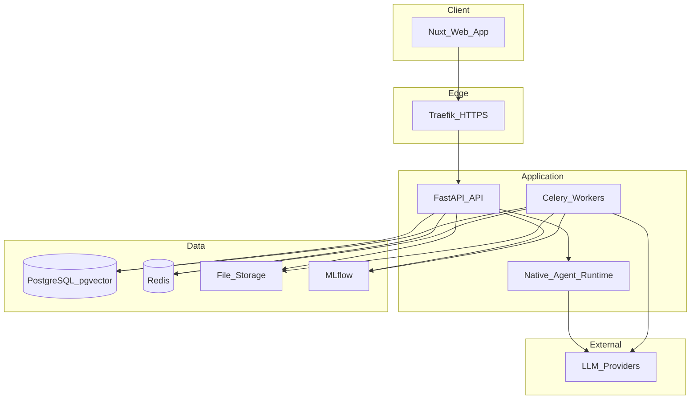
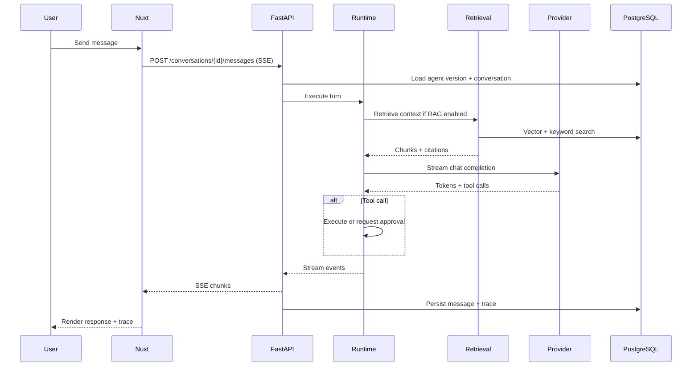
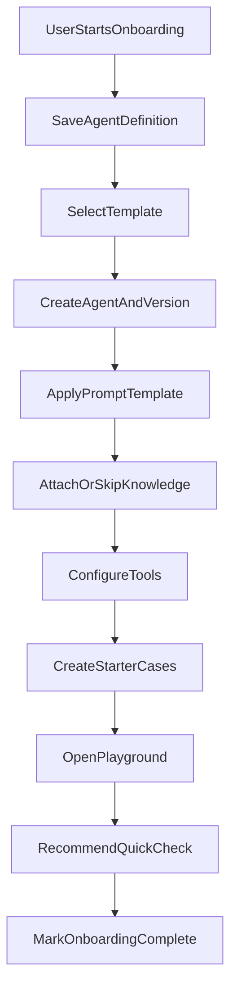
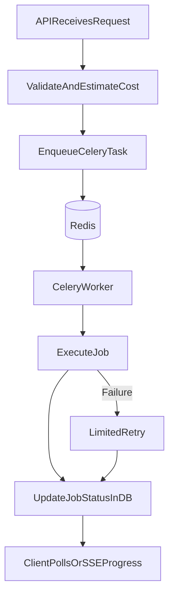
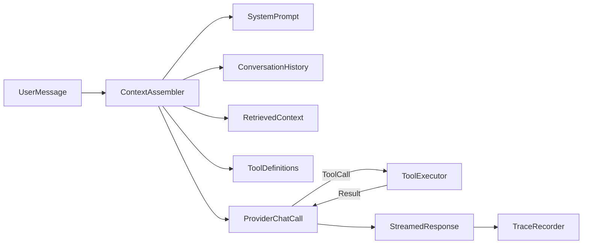
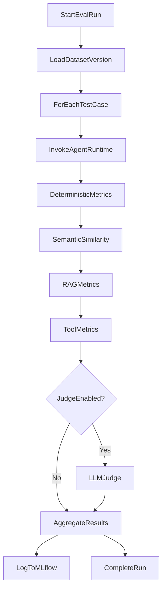
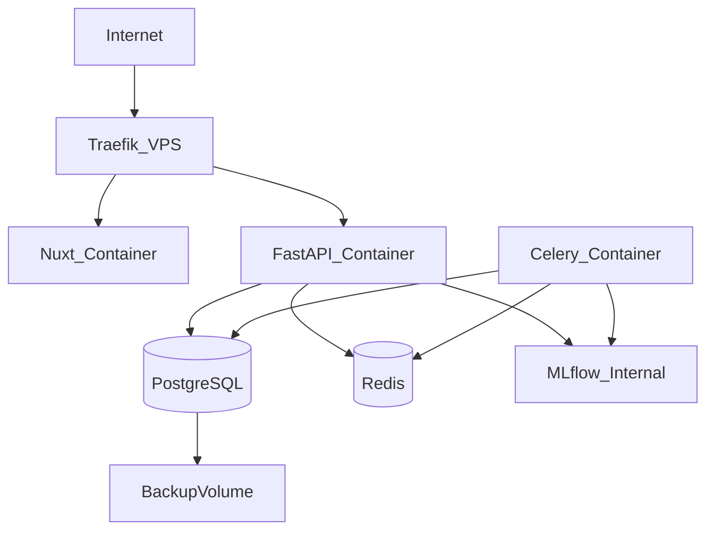

# System Design — AgentLab

## 1. Architecture Overview

AgentLab is a **modular monolith** deployed as separate containers via Docker Compose. Business logic lives in one FastAPI codebase with clear module boundaries. Workers share the same codebase and database.



## 2. Repository Structure

```text
agentlab/
├── apps/
│   ├── web/                 # Nuxt 4 frontend
│   └── api/                 # FastAPI backend
│       └── app/
│           ├── api/         # Route handlers
│           ├── authentication/
│           ├── agents/
│           ├── agent_versions/
│           ├── prompts/
│           ├── conversations/
│           ├── providers/
│           ├── runtime/
│           ├── knowledge/
│           ├── retrieval/
│           ├── tools/
│           ├── evaluations/
│           ├── judges/
│           ├── comparisons/
│           ├── templates/
│           ├── jobs/
│           ├── observability/
│           ├── models/      # SQLAlchemy models
│           ├── schemas/     # Pydantic schemas
│           ├── repositories/
│           ├── services/
│           └── core/        # Config, deps, security
├── workers/                 # Celery app entry
├── infrastructure/
│   ├── docker/
│   ├── monitoring/
│   └── scripts/
├── docs/
├── tests/
├── seed/
├── sample-packs/
├── docker-compose.yml
├── docker-compose.production.yml
└── .env.example
```

## 3. Component Responsibilities

| Component | Responsibility |
| --- | --- |
| **Nuxt Web** | UI, SSE client, auth cookie handling, form validation |
| **FastAPI API** | REST + SSE endpoints, auth, orchestration, sync operations |
| **Native Runtime** | Agent loop: prompt assembly, retrieval, tool calls, streaming |
| **Celery Workers** | Document processing, embeddings, batch eval, judge, red-team |
| **PostgreSQL** | Source of truth for all product state |
| **pgvector** | Vector similarity search |
| **Redis** | Celery broker, rate-limit counters, session cache (optional) |
| **File Storage** | Uploaded documents, exports, MLflow artifacts path |
| **MLflow** | Evaluation experiment tracking (internal network only) |
| **Traefik** | TLS termination, routing, health checks |

## 4. Request Flows

### 4.1 Chat request (playground)



### 4.2 Agent onboarding flow



### 4.3 Background job flow



## 5. Module Boundaries

Each FastAPI module owns:

- SQLAlchemy models (or re-exports from `models/`)
- Pydantic request/response schemas
- Repository (data access)
- Service (business logic)
- Router (HTTP handlers)

Cross-module communication goes through service interfaces, not direct model access from routers.

## 6. Runtime Architecture



**Step limits:** `max_agent_steps`, `max_tool_calls`, `timeout` enforced in runtime loop.

## 7. Evaluation Engine



## 8. Technology Versions

| Component | Version |
| --- | --- |
| Nuxt | 4.4.x |
| Python | 3.12 |
| FastAPI | 0.139.x |
| PostgreSQL | 16 |
| pgvector | 0.8.x |
| Redis | 7.x |
| Celery | 5.x |

## 9. Deployment Topology (Production)



Public: HTTPS on 443 only.
Internal network: PostgreSQL, Redis, MLflow not exposed.

## 10. Future Extensions (Documented, Not MVP)

- LangGraph runtime adapter (Phase 10)
- OpenTelemetry exporters to Langfuse/Phoenix
- CrewAI multi-agent adapter

## 11. Key Design Constraints

1. Provider API keys never reach the browser.
2. Historical agent versions are immutable.
3. Deterministic failures cannot be overridden by judge scores.
4. Expensive operations are always manual with cost preview.
5. Uploaded documents are untrusted content (RAG safety).
