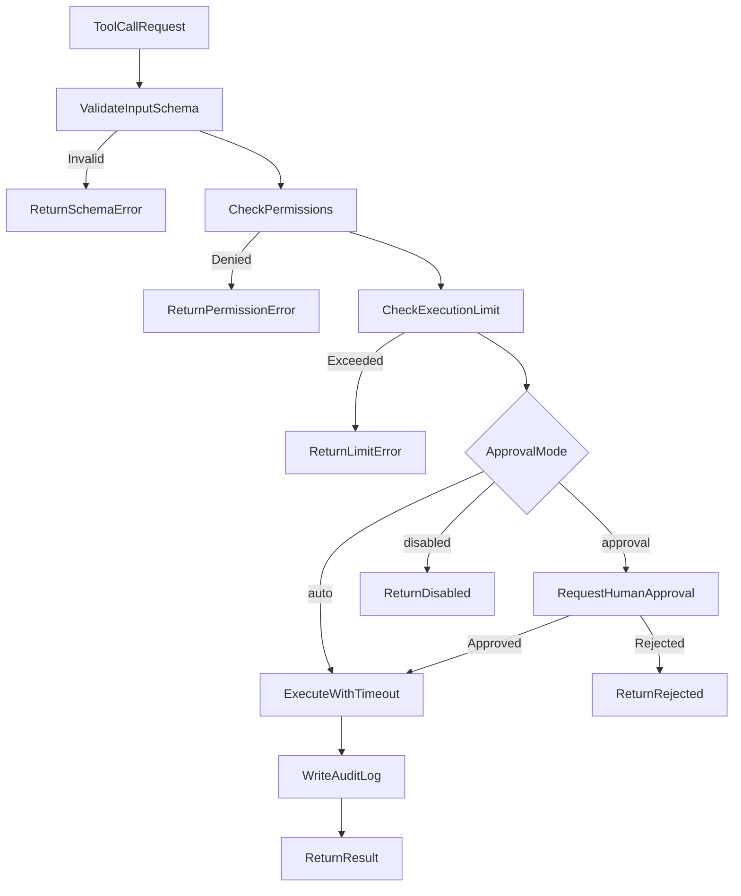

# Tool Design — AgentLab

## 1. Purpose

Provide safe, auditable tools that agents can call during conversations. No arbitrary code execution, shell access, SQL, or HTTP in MVP.

## 2. Initial Tools

| Tool | Risk | Default mode | Description |
| --- | --- | --- | --- |
| `calculator` | Low | auto | Safe math expression parser |
| `knowledge_search` | Low | auto | Search approved knowledge collections |
| `current_datetime` | Low | auto | Server-controlled date and time |

## 3. Tool Definition Schema

Every tool defines:

```json
{
  "name": "calculator",
  "description": "Evaluate a mathematical expression safely.",
  "input_schema": {
    "type": "object",
    "properties": {
      "expression": {"type": "string", "description": "Math expression"}
    },
    "required": ["expression"]
  },
  "output_schema": {
    "type": "object",
    "properties": {
      "result": {"type": "number"},
      "expression": {"type": "string"}
    }
  },
  "permissions": ["compute"],
  "timeout_seconds": 5,
  "max_executions_per_turn": 3,
  "error_behaviour": "return_error_to_model",
  "audit": true
}
```

## 4. Tool Implementations

### 4.1 Calculator

- Uses safe expression parser (e.g. `simpleeval` or custom AST walker).
- **Never** uses Python `eval()`.
- Supports: `+`, `-`, `*`, `/`, `%`, `**`, parentheses, basic functions (`sqrt`, `abs`, `round`).
- Rejects: variable assignment, imports, function calls beyond allowlist.

### 4.2 Knowledge Search

- Searches only collections linked to the current agent version.
- Input: `query` (string), optional `collection_id`.
- Output: ranked chunks with citations.
- Uses same retrieval service as RAG pipeline.

### 4.3 Current Date and Time

- Returns server UTC time and configurable timezone.
- No user input beyond optional timezone string from allowlist.
- Prevents model from hallucinating dates.

## 5. Tool Modes

| Mode | Behaviour |
| --- | --- |
| `auto` | Execute immediately |
| `approval` | Pause runtime; emit SSE approval event; wait for user |
| `disabled` | Return "tool disabled" error to model |

Configured per tool per agent version in `agent_version_tools`.

## 6. Tool Execution Flow



## 7. Human Approval UI

When approval required, SSE emits:

```json
{
  "event": "approval_required",
  "data": {
    "approval_id": "uuid",
    "tool": "knowledge_search",
    "arguments": {"query": "purchase order limits"},
    "reason": "Tool requires manual approval per agent configuration"
  }
}
```

User actions: `POST /tool-approvals/{id}/approve` or `/reject`.

## 8. Security Constraints

The model must **never** be able to:

- Run shell commands
- Run arbitrary Python
- Read arbitrary server files
- Read environment variables
- Make arbitrary HTTP requests
- Execute arbitrary SQL
- Install packages
- Modify infrastructure

Enforced by tool allowlist in runtime; no dynamic tool registration in MVP.

## 9. Audit Logging

Every tool execution writes to `audit_logs`:

| Field | Value |
| --- | --- |
| action | `tool.execute` |
| resource_type | `tool` |
| resource_id | tool name |
| details | arguments (sanitized), result status, duration |
| user_id | conversation owner |
| trace_id | linked trace |

## 10. Error Behaviour

| Error | Returned to model |
| --- | --- |
| Invalid input | Schema validation message |
| Timeout | "Tool execution timed out" |
| Permission denied | "Tool not permitted" |
| Execution limit | "Maximum tool calls reached" |
| Internal error | "Tool execution failed" (no stack trace) |

## 11. Future Tools (Documented, Not MVP)

- Approved HTTP connector (allowlisted URLs)
- Read-only SQL (approved views)
- Custom code sandbox

These require separate security design and are out of initial release.

## 12. Testing

- Unit tests per tool implementation
- Schema validation tests
- Approval flow integration tests
- Audit log verification
- Red-team cases for tool abuse
