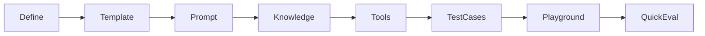

# User Experience Design — AgentLab

## 1. Design Goals

- **Guided, not overwhelming:** Template-first onboarding with progressive disclosure.
- **Evaluation-centric:** The product feels like a lab, not a chat app.
- **Honest feedback:** Results explain failures; judge scores never hide deterministic failures.
- **Cost-aware:** Expensive actions show estimates and require confirmation.

## 2. Visual Direction

- Light, professional product aesthetic (not dark-mode-purple AI default).
- Expressive typography: **DM Sans** (UI) + **IBM Plex Mono** (code/traces).
- Subtle atmospheric background (soft gradient or grid), not flat single-color.
- One composition per viewport on landing/login; brand "AgentLab" is hero-level on auth surfaces.
- Minimal cards; cards only where they contain user interaction.
- Accessible colour contrast (WCAG AA minimum).

## 3. Layout Patterns

### 3.1 App shell

```
┌─────────────────────────────────────────────────────────┐
│ Logo   Agents  Knowledge  Evaluations  ...    User menu │
├──────────┬──────────────────────────────────────────────┤
│ Side nav │ Main content                                 │
│ (collaps)│ ┌──────────────────────────────────────────┐ │
│          │ │ Page header + inline help toggle         │ │
│          │ ├──────────────────────────────────────────┤ │
│          │ │ Content                                  │ │
│          │ └──────────────────────────────────────────┘ │
└──────────┴──────────────────────────────────────────────┘
```

Mobile: bottom nav for primary sections; side nav becomes drawer.

### 3.2 Playground (three-panel)

```
┌────────────┬─────────────────────┬─────────────────────┐
│ Config     │ Conversation        │ Trace               │
│ panel      │ (streaming)         │ (retrieval, tools,  │
│            │                     │  tokens, cost)      │
│ Overrides  │                     │                     │
│ indicator  │                     │                     │
└────────────┴─────────────────────┴─────────────────────┘
```

Tablet: config collapses to drawer; trace below conversation.
Mobile: tabs — Chat | Config | Trace.

### 3.3 Evaluation run

Before run: confirmation modal with estimates (cases, calls, tokens, cost, background job notice).
During run: progress bar, pass/fail counts, cancel button.
After run: summary card + failed-case list with expandable explanations.

## 4. Onboarding Wizard

Eight steps with saved progress (`onboarding_progress` table):

| Step | Title | Key UI |
| --- | --- | --- |
| 1 | Define the agent | Form with examples; optional "Help Me Define" (manual AI draft) |
| 2 | Select template | Template cards with preview/compare |
| 3 | Configure behaviour | Structured prompt sections + completeness checklist |
| 4 | Prepare knowledge | Upload / paste / sample / skip |
| 5 | Configure tools | Tool cards with risk badges |
| 6 | Create test cases | Starter case templates |
| 7 | Test in playground | Guided first message |
| 8 | Run initial evaluation | Quick Check recommendation |



Resume wizard from dashboard if incomplete.

## 5. Inline Guidance

Every important page includes a collapsible help panel:

- What this page is for
- Why it matters
- What you need before starting
- Recommended steps
- Example inputs
- Common mistakes
- How to verify success
- Recommended next action

Field-level tooltips for technical settings (e.g. Retrieval Top-K).

## 6. Guided Empty States

| Context | Actions |
| --- | --- |
| No agents | Create First Agent, Choose Template, Install Sample Agent |
| No knowledge | Upload Manual, Create FAQ, Install Sample, Read Guide |
| No datasets | Create Manually, Use Template, Import CSV, Generate Draft (manual) |
| No eval runs | Run Quick Check, Learn Modes, View Sample Report |

## 7. Expensive Action Pattern

All costly operations share a confirmation pattern:

1. User clicks action button (e.g. "Run LLM Judge").
2. Modal shows: operation summary, model, estimated calls/tokens/cost, background job notice.
3. User confirms or cancels.
4. Progress UI with cancel where safe.
5. Results with explanations.

Never auto-trigger on save or normal chat.

## 8. Dashboard

First viewport: key metrics only (agents, pass rate, release status, recent regressions, cost, job status).

Quick actions row: Create Agent, Open Playground, Add Knowledge, Create Dataset, Run Evaluation, Compare Versions.

No decorative chart overload.

## 9. Prompt Editor UX

- Full-screen toggle
- Auto-save draft with unsaved-change warning
- Character count + token estimate
- Section templates (ROLE, OBJECTIVE, etc.)
- Side-by-side diff between versions
- Completeness checklist (rule-based, not AI quality score)
- "Analyse and Improve Prompt" — manual, with cost estimate

## 10. Accessibility

- Keyboard navigation for all interactive elements
- Focus indicators
- ARIA labels on icon buttons
- Screen-reader-friendly trace panel (structured lists, not raw JSON dump)
- Reduced motion respects `prefers-reduced-motion`

## 11. Motion

Intentional, minimal:

- Page transitions (fade/slide, <200ms)
- Streaming cursor in chat
- Progress bar animation during eval jobs
- No gratuitous parallax or particle effects

## 12. Component Library

**reka-ui** (Radix Vue lineage) + Tailwind CSS utilities. Custom components for:

- `HelpPanel`, `CostEstimateModal`, `TraceViewer`, `PromptSectionEditor`, `EvalResultCard`, `VersionDiff`, `TemplateCard`

Pinia only for: auth session, active agent context, playground override state.
